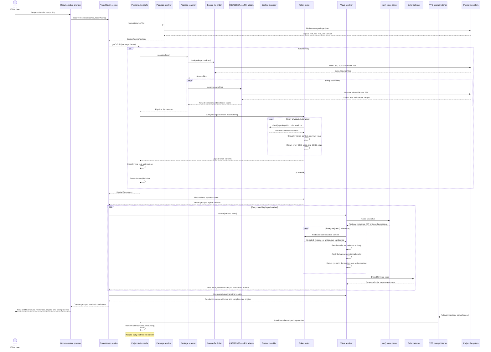

# Taiga UI Design Tokens Plugin

WebStorm plugin for exploring Taiga UI CSS custom properties directly in the editor.

The plugin reads the version of `@taiga-ui/design-tokens` installed in the current project instead of shipping a hardcoded token catalog. Quick documentation will show the declarations available for desktop, mobile, light, and dark themes.

## Planned experience

Given:

```css
.alert-icon {
    color: var(--tui-text-warning);
}
```

Quick documentation should show:

- the installed `@taiga-ui/design-tokens` version;
- matching desktop and mobile declarations;
- light and dark theme values;
- both the raw declaration and its recursively resolved value;
- the token-reference tree, source files, and line numbers;
- color previews when the final value is a color.

The plugin will show all statically known candidates. It will not claim to know one runtime value when CSS cascade, DOM state, media queries, or project overrides make the result ambiguous.

## Architecture

This sequence diagram is the architectural contract for the plugin. Pull requests that change the data flow or introduce a new architectural layer must update the diagram in the same change.



Architecture status:

- implemented: package discovery, PSI extraction, context classification, immutable indexing, project-level caching, and targeted VFS invalidation;
- implemented in Stage 3: balanced `var(...)` parsing, context-aware recursive resolution, structured fallback and cycle results, color detection, and equivalent-result grouping;
- Stage 3 is complete once the recursive resolution change is merged;
- next in Stage 4: documentation provider, caret detection, rendering, and navigation.

Package boundaries:

```text
org.taigaui.designtokens
├── packageinfo  package discovery and installed-package metadata
├── index        physical declarations, logical variants, classification, and indexing
├── resolution   pure var parsing, candidate selection, recursive resolution, and grouping
├── psi          IntelliJ PSI adapter for CSS, SCSS, and Less
└── project      project service, package cache, VFS invalidation, and resolution entry point
```

Dependencies point inward: `project` orchestrates `packageinfo`, `index`, `resolution`, and `psi`; `resolution` depends on immutable contracts from `index`; `psi` depends on extraction contracts from `index`; and `index` depends only on `packageinfo` where installed-package information is required. Package discovery, the cache core, and recursive resolution remain independent from PSI types.

The project cache is keyed by normalized real package root and installed version. Multiple logical npm or pnpm paths that point to the same physical package reuse one immutable index. A version change or a logical package pointing to a different real target replaces the old entry.

VFS events only remove affected cache entries. CSS, SCSS, Less, `package.json`, package-root replacement, and relevant directory changes invalidate the matching package. Unrelated project files and documentation files inside the package do not rebuild the index. Rebuilding is lazy, so a burst of package-manager events produces at most one scan on the next request.

Platform classification has no unknown state. A declaration under a `mobile` package path or a mobile `tuiPlatform` or `data-platform` selector is mobile; every other declaration is desktop. Theme may remain unspecified when neither light nor dark context is encoded by the source.

A `DesignTokenDeclaration` is an immutable physical source fact: its `value` remains exactly what was parsed from CSS, SCSS, or Less. The declaration also retains its outer-to-inner selector chain. A `DesignTokenVariant` is a logical value candidate identified by token name, platform/theme context, and raw value. Exact copies published in CSS, Less, and SCSS become one logical variant with multiple origins rather than duplicate hover entries.

The value parser scans balanced functions and emits text/reference parts. It resolves several references inside compound values, nested fallbacks, and empty fallbacks without replacing `var(...)` text inside quoted strings or comments. Raw variant values are never mutated.

Reference selection is deterministic. Mobile light/dark first uses the matching mobile theme, then mobile unspecified, then the matching desktop theme, and finally desktop unspecified. Desktop references stay on desktop. Unspecified themes never guess between light and dark. Several distinct variants at the first compatible precedence produce an explicit ambiguity.

The active resolution context is separate from the selected declaration context. When a mobile lookup uses a compatible desktop declaration, references inside that declaration continue to resolve against the original mobile context, matching how default custom-property declarations and mobile overrides interact.

A `DesignTokenValueResolution` is either resolved or unresolved. Resolved results contain the final value, nested reference tree, fallback decisions, and optional canonical color metadata. Unresolved results retain explicit missing, ambiguous, circular, or invalid-expression reasons. Cycle nodes include both the declaration context and active resolution context. A fallback inside a cyclic token cannot hide its own cycle, while an outer consumer fallback may recover from an invalid cyclic referenced value.

`DesignTokenResolutionGroup` collapses equal terminal values for presentation. Hex colors such as `#fff` and `#FFFFFF` share a canonical key. Each group retains root origins separately from all origins reachable through selected references and evaluated fallbacks.

## Development status

Stages 1 and 2 provide the buildable WebStorm plugin scaffold, installed-package discovery, PSI extraction, logical indexing, project caching, and VFS invalidation. Stage 3 adds pure recursive value resolution and exposes grouped results through `DesignTokenIndexService.resolveToken`. The next stage connects these results to WebStorm quick documentation and navigation. See [the implementation roadmap](docs/roadmap.md) for the remaining work.

## Requirements

- JDK 21
- Node.js 22 and npm for the real-package test fixture only
- the checked-in Gradle Wrapper

The installed plugin itself does not require Node.js. The npm dependency in this repository is only a real-world fixture for tests.

## Commands

Run tests without installing the npm fixture:

```bash
./gradlew test
```

The real-package tests are skipped when `node_modules/@taiga-ui/design-tokens` is absent.

Install the pinned package fixture and run the complete quality gate:

```bash
npm ci
./gradlew check
```

`check` runs tests, ktlint formatting checks, and detekt static analysis. Apply safe formatting fixes with:

```bash
./gradlew ktlintFormat
```

Run the sandbox IDE or build the distributable plugin:

```bash
./gradlew runIde
./gradlew buildPlugin
```

`runIde` starts an isolated WebStorm instance with the plugin installed. The distributable ZIP is generated under `build/distributions`.
