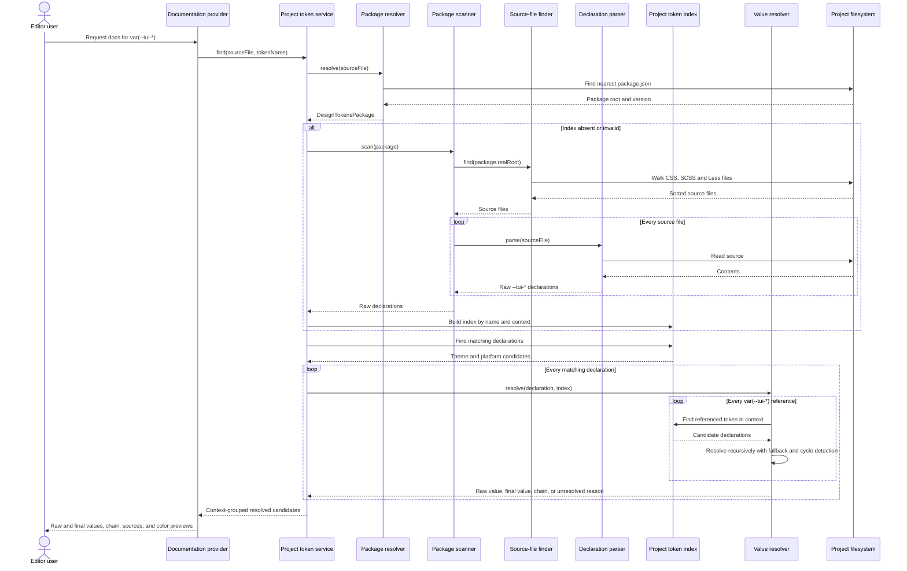

# Taiga UI Design Tokens Plugin

WebStorm plugin for exploring Taiga UI CSS custom properties directly in the editor.

The plugin reads the version of `@taiga-ui/design-tokens` installed in the current project instead of shipping a hardcoded token catalog. Quick documentation will show the declarations available for desktop, mobile, light, and dark themes.

## Planned experience

Given:

```css
.alert-icon {
    color: var(--tui-text-warning);
}
```

Quick documentation should show:

- the installed `@taiga-ui/design-tokens` version;
- matching desktop and mobile declarations;
- light and dark theme values;
- both the raw declaration and its recursively resolved value;
- the token-reference chain, source files, and line numbers;
- color previews when the final value is a color.

The plugin will show all statically known candidates. It will not claim to know one runtime value when CSS cascade, DOM state, media queries, or project overrides make the result ambiguous.

## Architecture

This sequence diagram is the architectural contract for the plugin. Pull requests that change the data flow or introduce a new architectural layer must update the diagram in the same change.



Architecture status:

- implemented: package resolver, source-file finder, declaration parser, and package scanner;
- next in Stage 2: context-aware project index, caching, and filesystem invalidation;
- planned for Stage 3: recursive value resolution with fallbacks and cycle detection;
- planned for Stage 4: documentation provider, editor integration, and navigation.

A `DesignTokenDeclaration` is an immutable source fact: its `value` remains exactly what was parsed from CSS, SCSS, or Less. Recursive resolution produces a separate result containing the final value, reference chain, fallback usage, or an unresolved reason. This preserves source fidelity while allowing hover documentation to show the actual color or other terminal value.

The filesystem, parsing, indexing, and value-resolution classes remain independent from IntelliJ Platform APIs. IDE-specific code will depend on these layers rather than putting PSI, project services, or editor state into the scanner or resolver.

## Development status

Stage 1 provides the buildable WebStorm plugin scaffold. Stage 2 resolves the nearest installed `@taiga-ui/design-tokens` package and scans its CSS, SCSS, and Less files for raw `--tui-*` declarations without invoking Node.js or a package manager. See [the implementation roadmap](docs/roadmap.md) for the following stages.

## Requirements

- JDK 21
- Node.js 22 and npm for the real-package test fixture only
- the checked-in Gradle Wrapper

The installed plugin itself does not require Node.js. The npm dependency in this repository is only a real-world fixture for tests.

## Commands

Run the test suite without installing the npm fixture:

```bash
./gradlew test
```

The real-package tests are skipped when `node_modules/@taiga-ui/design-tokens` is absent.

Install the pinned package fixture and run the complete test suite:

```bash
npm ci
./gradlew test
```

Run the sandbox IDE or build the distributable plugin:

```bash
./gradlew runIde
./gradlew buildPlugin
```

`runIde` starts an isolated WebStorm instance with the plugin installed. The distributable ZIP is generated under `build/distributions`.
