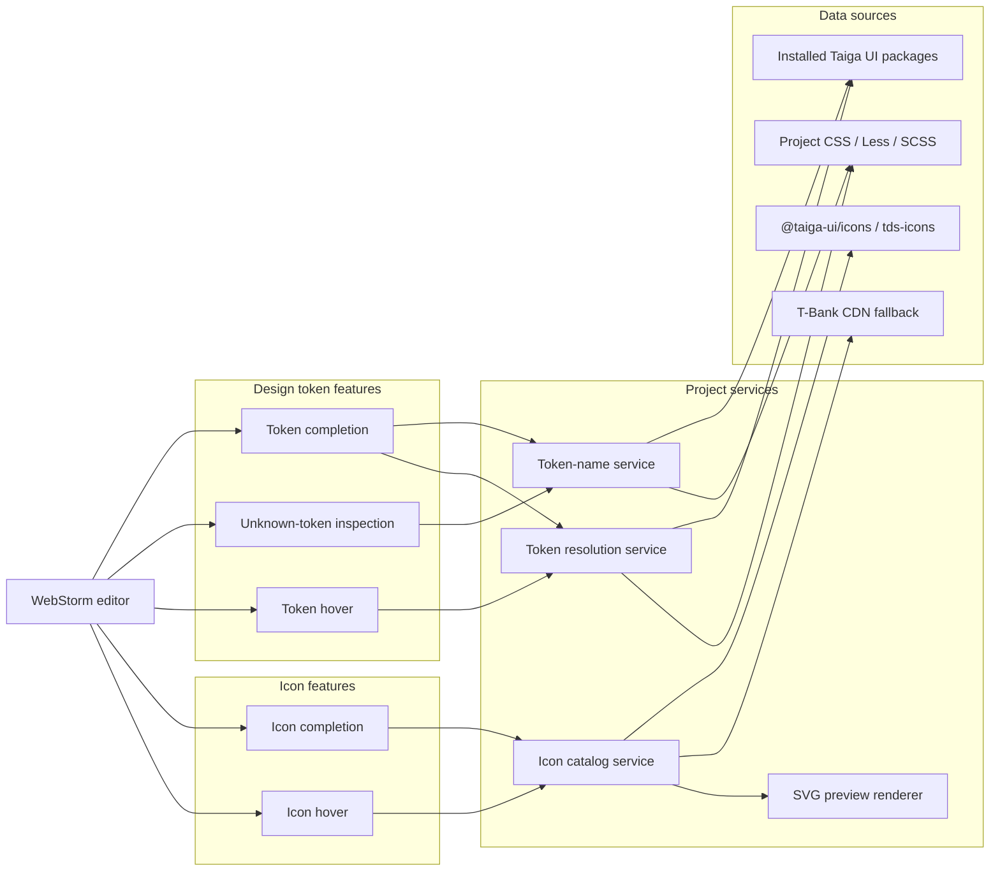
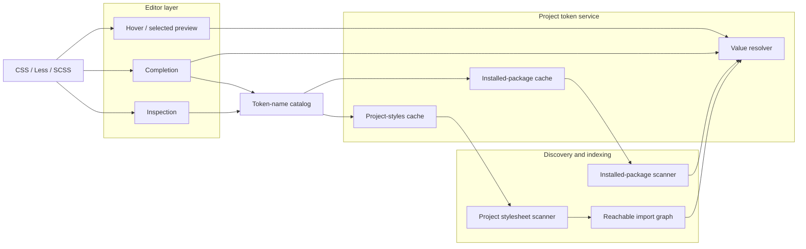
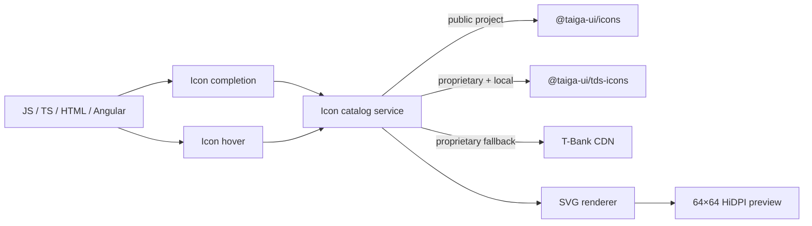
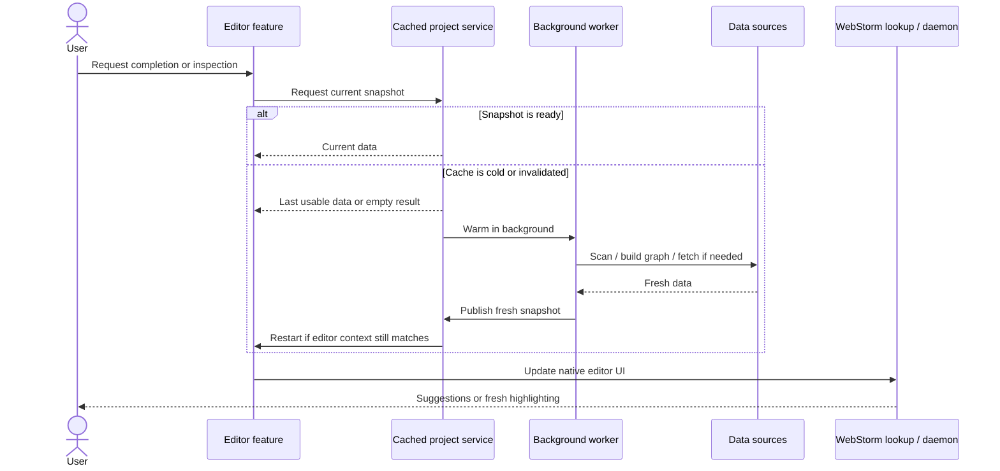

# Taiga UI Design Tokens Plugin

WebStorm plugin for exploring and using Taiga UI CSS custom properties and icon names directly in the editor.

The plugin reads the Taiga UI packages installed in the current project instead of shipping hardcoded catalogs. It combines installed Taiga UI declarations with reachable project styles, resolves effective platform/theme values, and exposes that model through editor completion, unknown-token inspections, and a custom Swing hover popup. It also discovers Taiga UI SVG icons and exposes them through native `@tui.*` completion, selected-item previews, and delayed hover previews.

## Editor experience

### Token completion

Inside CSS, Less, and SCSS `var(...)` expressions, typing `--tui-` opens WebStorm's native completion lookup with design-token names discovered from the current project and installed Taiga UI packages.

The completion source is shared with unknown-token inspection. Installed package tokens and reachable project stylesheet tokens are merged into one name catalog while value resolution still uses the stricter reachable declaration graph.

The native WebStorm lookup remains the primary completion UI. When a `--tui-*` item is selected, a non-focusable preview beside the lookup resolves and shows the effective token value, source grouping, and color where applicable. Moving through the list with the keyboard updates that preview without stealing focus from the editor.

A cold completion request does not build the graph on the completion/UI path. The graph is warmed in a project-service coroutine; the latest token-name snapshot remains usable while an invalidated graph refreshes. If the first completion request starts a cold build, completion is reopened only when the caret is still inside a current `var(--tui-...)` context, so continuing to type does not invalidate the warmup result.

### Icon completion

Inside JavaScript, TypeScript, and HTML strings, typing `@tui.` opens WebStorm's native completion lookup with icon names discovered from the current project:

```ts
const arrow = '@tui.a-arrow-down';
const flag = '@tui.flags.ab';
```

Static HTML and Angular template attributes use the same completion path:

```html
<button iconStart="@tui.fancy.medium.info-circle">Save</button>
<button [iconStart]="'@tui.fancy.medium.info-circle'">Save</button>
```

Directory paths become dot-separated icon namespaces. For example, `@taiga-ui/icons/src/flags/ab.svg` becomes `@tui.flags.ab`.

Public and proprietary icon catalogs are intentionally mutually exclusive. Without `@taiga-ui/proprietary`, completion uses only the installed `@taiga-ui/icons/src/**/*.svg` package. When `@taiga-ui/proprietary` is installed, public icon names are not contributed and proprietary discovery uses the following precedence:

1. installed `@taiga-ui/tds-icons/src/**/*.svg` files;
2. when local `tds-icons` is unavailable, the T-Bank design-token icon catalog at `https://cdn.tbank.ru/core/design-tokens/v1/web/data.json`.

A nested proprietary file such as `fancy/medium/info-circle.svg` becomes `@tui.fancy.medium.info-circle`. CDN groups follow the same mapping, so an `icons` entry such as `"fancy/medium": ["air-hockey"]` becomes `@tui.fancy.medium.air-hockey`. The same group/name pair also identifies the SVG at `https://cdn.tbank.ru/core/design-tokens/v1/web/fancy/medium/air-hockey.svg`.

The native completion list has a compact, fixed-size white SVG preview beside it. Moving through `@tui.*` suggestions with the Up/Down keys immediately updates the selected icon without changing the preview width. The icon name is intentionally omitted from the preview card. SVGs are rendered at 64×64 logical units and wrapped as HiDPI-aware images so Retina displays use the corresponding device-pixel resolution instead of stretching a low-resolution raster.

Hovering a complete `@tui.*` icon reference for one second shows the same SVG preview. Moving to another icon, leaving the icon, selecting text, clicking, dragging, or opening completion cancels the pending hover or closes the current popup.

Filesystem scanning and the optional CDN request never run on the completion/UI path. The icon catalog is warmed in a project-service coroutine and cached by the nearest `node_modules/@taiga-ui` scope. A cold completion request contributes no custom icon items yet and reopens completion after warmup only if the caret is still inside an `@tui.*` string context. If WebStorm already has an HTML attribute-value lookup open, the plugin restarts that lookup after the icon catalog becomes available.

### Inspection

Unknown Taiga UI token names used as the first argument of `var(...)` are highlighted in CSS, Less, and SCSS:

```css
.demo {
    color: var(--tui-text-primry);
}
```

Incomplete prefixes can offer several `Replace with ...` quick fixes, while close typos only offer a conservative replacement when there is a sufficiently close and unambiguous known token. Distant or ambiguous unknown names remain warning-only.

The inspection uses a strict token-name snapshot. A cold or invalidated catalog does not produce warnings from stale data; the catalog is warmed in the background and daemon highlighting is restarted after a fresh snapshot becomes available.

### Hover

Hovering a complete Taiga UI design-token reference resolves its effective declarations and shows a custom Swing popup. Package and project candidates are grouped separately, color values get a swatch, and each source can be navigated to from the popup.

The popup is suppressed while completion is active and while text is selected. Moving directly from one token to another closes the stale popup immediately before the next delayed resolution starts.

## Architecture

The diagrams below define the architectural boundaries of the plugin. Pull requests that introduce a new subsystem, data source, or dependency between architectural layers should update the relevant diagram instead of expanding one global sequence trace.

### Architecture overview

The plugin has two largely independent data pipelines: design tokens and icons. Editor features consume project-level services, while scanning, graph construction, network access, and rendering stay behind those service boundaries.



### Design token subsystem

Token names and token values intentionally have different reachability rules. Completion and inspection need a broad catalog of known names, while hover and selected-item preview need the stricter reachable declaration graph to determine effective values.



The broad token-name catalog does not change value-resolution semantics. A token may be known to completion and inspection while still being unreachable for effective-value resolution from the current source context.

### Icon subsystem

Icon completion and icon hover share one catalog service and one SVG renderer. Public and proprietary catalogs remain mutually exclusive; the CDN is only a proprietary fallback when local `tds-icons` is unavailable.



### Background loading and caching

Completion never performs expensive discovery on the UI path. Token and icon services follow the same cold-cache pattern: return an already usable snapshot when possible, warm missing data in the background, and restart the editor feature only if its context is still valid.



Cache invalidation remains lazy. VFS and document changes invalidate the smallest relevant package/project/icon cache, while expensive rebuilds happen on the next request outside cache monitors and outside the UI thread.

### Package boundaries

```text
org.taigaui.designtokens
├── index          immutable declaration/index contracts
├── packageinfo    installed package discovery and style scanning
├── resolution     var() parsing, candidate selection, recursive resolution, and grouping
├── psi            IntelliJ CSS/SCSS/Less PSI adapter
├── project        package/project graph orchestration, caches, invalidation, and resolution entry point
├── completion     token completion, strict inspection names, native lookup integration, and selected-item preview
├── icons          @tui.* completion, local/remote catalogs, SVG preview rendering, and icon hover
└── documentation  token-reference scanning, hover controller, Swing model, and Swing popup
```

Dependencies point inward. `completion` and `documentation` consume the project-level token service; `project` orchestrates `packageinfo`, `index`, `resolution`, and `psi`; `resolution` depends on immutable contracts from `index`; `psi` adapts IntelliJ Platform syntax trees into index declarations. `icons` is independent of the token-resolution graph and reads only the nearest installed icon-package scope plus the optional proprietary CDN fallback.

### Installed package graph

The installed-package scanner starts from the nearest `node_modules/@taiga-ui` scope for the source file. It resolves the installed Taiga UI packages and follows style imports to preserve package precedence and override behavior.

When `@taiga-ui/proprietary` is installed, the value-resolution graph intentionally keeps its reachability rules: declarations in unrelated Taiga UI package files do not become active merely because they exist somewhere under `node_modules`. The broader token-name catalog used by completion and inspection is separate and scans public style roots for known names without changing value-resolution semantics.

### Project stylesheet graph

Project stylesheet discovery starts from the current source file and configured style entrypoints, then follows local CSS/Less/SCSS imports. Reachable project declarations are indexed as an application layer over installed package declarations.

The project cache is separate from the installed-package cache because the two layers have different invalidation rates and resolution semantics.

### Cache and threading

Cache monitors protect only cache bookkeeping. Expensive graph construction and filesystem work happen outside synchronized sections.

Hover resolution, cold completion warming, and selected-item preview resolution run off the UI thread. Completion keeps a token-name snapshot so normal typing can continue to show known suggestions while document edits invalidate and refresh the underlying project graph. The completion preview listens to native lookup selection changes without requesting focus, and stale preview jobs are cancelled when keyboard navigation selects another token.

Icon catalog discovery and SVG loading/rendering also run off the UI thread. Installed SVG trees are scanned once per nearest `node_modules/@taiga-ui` scope and cached for subsequent completion and hover requests. The network fallback is attempted only when `@taiga-ui/proprietary` is present and a local `@taiga-ui/tds-icons/src` directory is not available. Selected-icon and hover previews share the cached catalog and render SVG sources at a fixed logical size with an explicit HiDPI wrapper so the same preview remains sharp on Retina displays.

Unknown-token inspection shares the same background token-name warmup but uses strict freshness. If the index is cold or invalidated, the inspection pass returns without warnings, the graph is warmed in the background, and WebStorm highlighting is restarted only after a fresh installed + project token catalog is available. Completion and inspection callbacks waiting on the same warmup are preserved independently.

### Resolution model

Project overrides are evaluated as an application layer before installed package candidates. The resolver keeps deterministic order only where the source graph proves it; otherwise conflicting candidates remain ambiguous instead of inventing an order.

Recursive `var(...)` references are resolved through the same context-aware candidate selection model, with cycle protection and grouped source information preserved for hover rendering.

## Development status

| Area | Status | Next |
| --- | --- | --- |
| Installed package discovery and token indexing | ✅ Implemented | — |
| Project stylesheet graph and override semantics | ✅ Implemented | — |
| Recursive token value resolution | ✅ Implemented | — |
| Token hover and navigation | ✅ Implemented | Accessibility and optional source details |
| Token completion and unknown-token inspection | ✅ Implemented | Deprecated-token replacements |
| Icon completion, selected preview, and hover | ✅ Implemented | Release hardening |
| Diagnostics and IDE compatibility | ⏳ In progress | Telemetry-free diagnostics and Plugin Verifier matrix |
| Distribution | ⏳ Remaining | Signing and Marketplace publishing |

Stages 1 through 4 are implemented. Stage 5 core editor features are implemented; the remaining work is production hardening and publishing. See [the implementation roadmap](docs/roadmap.md) for the detailed checklist.

## Requirements

- IntelliJ Platform / WebStorm 2025.3.6;
- Java 21;
- Gradle wrapper from the repository;
- Node.js/npm only for real-package integration fixtures.

## Local development

Install the root npm fixtures:

```bash
npm ci
```

Run checks and build the plugin:

```bash
./gradlew check buildPlugin
```

Run the isolated WebStorm sandbox:

```bash
./gradlew runIde
```

Open a real local project directly in the sandbox:

```bash
./gradlew runIde -PsandboxProject=/absolute/path/to/project
```

See [local debugging](docs/local-debugging.md) for using an installed WebStorm build, attaching a debugger on port 5005, inspecting sandbox logs, and resetting sandbox state.

`runIde` starts an isolated WebStorm instance with the plugin installed. The distributable ZIP is generated under `build/distributions`.