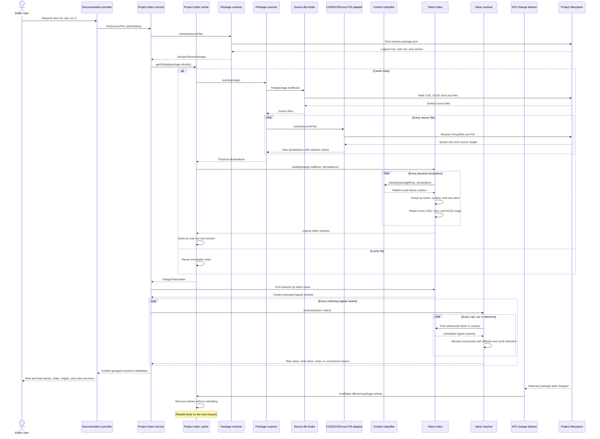

# Taiga UI Design Tokens Plugin

WebStorm plugin for exploring Taiga UI CSS custom properties directly in the editor.

The plugin reads the version of `@taiga-ui/design-tokens` installed in the current project instead of shipping a hardcoded token catalog. Quick documentation will show the declarations available for desktop, mobile, light, and dark themes.

## Planned experience

Given:

```css
.alert-icon {
    color: var(--tui-text-warning);
}
```

Quick documentation should show:

- the installed `@taiga-ui/design-tokens` version;
- matching desktop and mobile declarations;
- light and dark theme values;
- both the raw declaration and its recursively resolved value;
- the token-reference chain, source files, and line numbers;
- color previews when the final value is a color.

The plugin will show all statically known candidates. It will not claim to know one runtime value when CSS cascade, DOM state, media queries, or project overrides make the result ambiguous.

## Architecture

This sequence diagram is the architectural contract for the plugin. Pull requests that change the data flow or introduce a new architectural layer must update the diagram in the same change.



Architecture status:

- implemented: package resolver, stylesheet PSI extraction, parent selector chains, package scanner, selector-aware context classifier, immutable token index, project-level cache, and targeted VFS invalidation;
- Stage 2 is complete once cache and invalidation integration tests are merged;
- planned for Stage 3: recursive value resolution with fallbacks and cycle detection;
- planned for Stage 4: documentation provider, editor integration, and navigation.

Package boundaries:

```text
org.taigaui.designtokens
├── packageinfo  package discovery and installed-package metadata
├── index        pure domain models, scanning, classification, and indexing
├── psi          IntelliJ PSI adapter for CSS, SCSS, and Less
└── project      project service, package cache, and VFS invalidation
```

Dependencies point inward: `project` orchestrates `packageinfo`, `index`, and `psi`; `psi` depends on contracts from `index`; and `index` depends only on `packageinfo` where installed-package information is required. `packageinfo` and the cache core remain independent from PSI types.

The project cache is keyed by normalized real package root and installed version. Multiple logical npm or pnpm paths that point to the same physical package reuse one immutable index. A version change or a logical package pointing to a different real target replaces the old entry.

VFS events only remove affected cache entries. CSS, SCSS, Less, `package.json`, package-root replacement, and relevant directory changes invalidate the matching package. Unrelated project files and documentation files inside the package do not rebuild the index. Rebuilding is lazy, so a burst of package-manager events produces at most one scan on the next request.

Platform classification has no unknown state. A declaration under a `mobile` package path or a mobile `tuiPlatform` or `data-platform` selector is mobile; every other declaration is desktop. Theme may remain unspecified when neither light nor dark context is encoded by the source.

A `DesignTokenDeclaration` is an immutable physical source fact: its `value` remains exactly what was parsed from CSS, SCSS, or Less. The declaration also retains its outer-to-inner selector chain. A `DesignTokenVariant` is a logical value candidate identified by token name, platform/theme context, and raw value. Exact copies published in CSS, Less, and SCSS become one logical variant with multiple origins rather than duplicate hover entries.

Different raw values are never merged at index time, even when they may later resolve to the same terminal value. Recursive resolution produces a separate result containing the final value, reference chain, fallback usage, or an unresolved reason. This preserves source fidelity while allowing hover documentation to show the actual color or other terminal value.

## Development status

Stage 1 provides the buildable WebStorm plugin scaffold. Stage 2 resolves the nearest installed `@taiga-ui/design-tokens` package, extracts declarations and selector chains through PSI, classifies them by platform and theme, groups parallel source formats into logical token variants, and caches the resulting index per installed package without invoking Node.js or a package manager at plugin runtime. See [the implementation roadmap](docs/roadmap.md) for the following stages.

## Requirements

- JDK 21
- Node.js 22 and npm for the real-package test fixture only
- the checked-in Gradle Wrapper

The installed plugin itself does not require Node.js. The npm dependency in this repository is only a real-world fixture for tests.

## Commands

Run tests without installing the npm fixture:

```bash
./gradlew test
```

The real-package tests are skipped when `node_modules/@taiga-ui/design-tokens` is absent.

Install the pinned package fixture and run the complete quality gate:

```bash
npm ci
./gradlew check
```

`check` runs tests, ktlint formatting checks, and detekt static analysis. Apply safe formatting fixes with:

```bash
./gradlew ktlintFormat
```

Run the sandbox IDE or build the distributable plugin:

```bash
./gradlew runIde
./gradlew buildPlugin
```

`runIde` starts an isolated WebStorm instance with the plugin installed. The distributable ZIP is generated under `build/distributions`.
