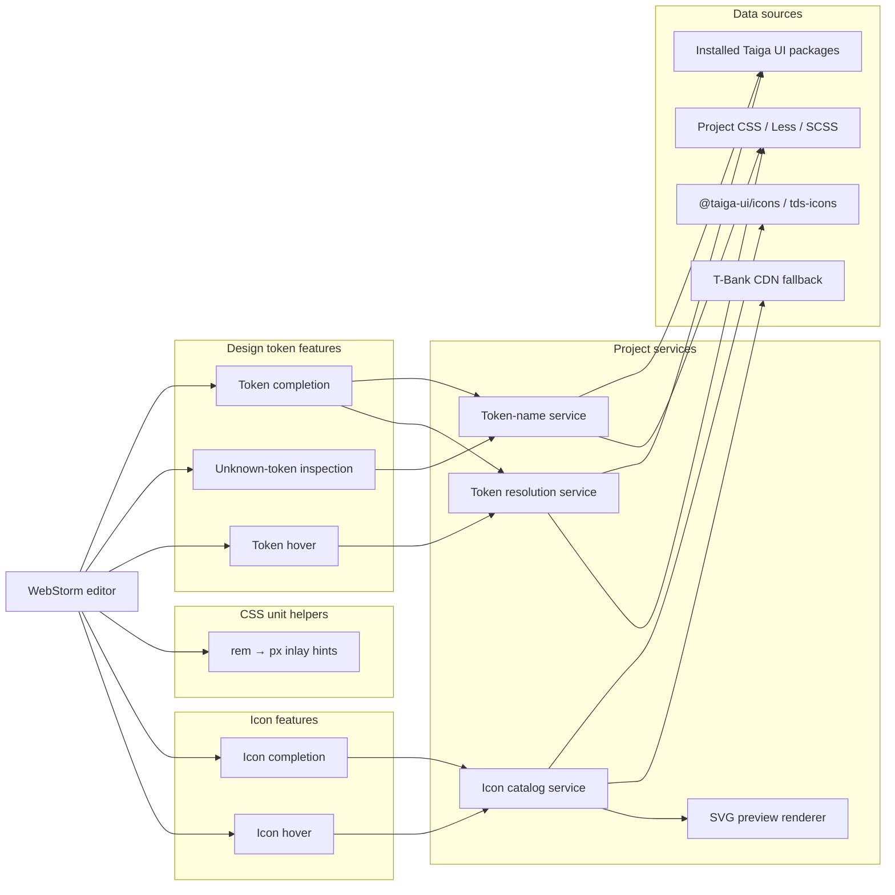
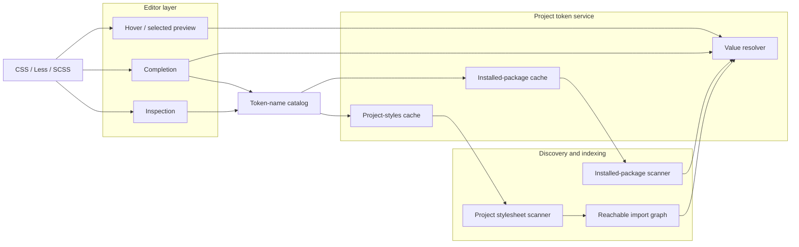
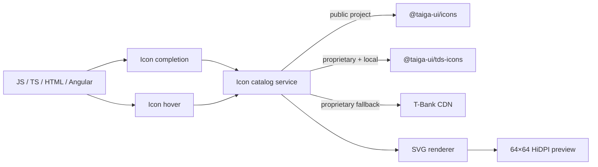
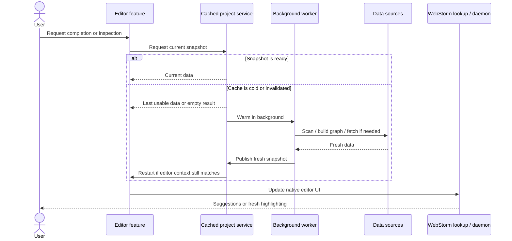

# Architecture

This document is the architectural contract for the Taiga UI Design Tokens Plugin.

Keep `README.md` focused on product capabilities. Changes that introduce a new subsystem, data source, cache boundary, or dependency between architectural layers should update this document in the same pull request.

## Architecture overview

The plugin has two largely independent project-data pipelines for design tokens and icons, plus lightweight editor-only helpers for CSS units. Editor features consume project-level services only when they need discovery or cached project data; stateless transformations stay at the editor layer.



## Design token subsystem

Token names and token values intentionally have different reachability rules.

Completion and inspection need a broad catalog of known names. Hover and selected-item preview need the stricter reachable declaration graph to determine effective values.



The broad token-name catalog must not change value-resolution semantics. A token can be known to completion and inspection while still being unreachable for effective-value resolution from the current source context.

### Installed package graph

The installed-package scanner starts from the nearest `node_modules/@taiga-ui` scope for the source file. It resolves installed Taiga UI packages and follows style imports to preserve package precedence and override behavior.

When `@taiga-ui/proprietary` is installed, the value-resolution graph keeps its reachability rules: declarations in unrelated Taiga UI package files do not become active merely because they exist somewhere under `node_modules`.

The broader token-name catalog used by completion and inspection is separate and may scan additional public style roots for known names without changing effective-value semantics.

### Project stylesheet graph

Project stylesheet discovery starts from the current source file and configured style entrypoints, then follows local CSS/Less/SCSS imports.

Reachable project declarations are indexed as an application layer over installed package declarations.

The project cache is separate from the installed-package cache because these layers have different invalidation rates and resolution semantics.

### Resolution model

Project overrides are evaluated as an application layer before installed package candidates.

The resolver keeps deterministic order only where the source graph proves it. Conflicting candidates remain ambiguous instead of inventing an order.

Recursive `var(...)` references use the same context-aware candidate selection model, with cycle protection and grouped source information preserved for editor presentation.

## CSS unit helpers

CSS unit helpers are intentionally stateless editor features. They do not participate in token discovery, project graphs, caches, or package resolution.

The `rem` inlay feature:

- runs only for CSS, Less, and SCSS editor files;
- recognizes literal `rem` dimensions in source text;
- converts literals with the fixed browser-default assumption `1rem = 16px`;
- ignores matching text inside comments and strings;
- groups multiple `rem` values from the same declaration line into one hint;
- renders through IntelliJ's declarative inlay-hints API after the declaration semicolon, without changing file contents or competing with Quick Documentation.

Future local unit conversions should stay in this subsystem unless they require project-specific configuration or discovery.

## Icon subsystem

Icon completion and icon hover share one catalog service and one SVG renderer.

Public and proprietary catalogs are mutually exclusive. The CDN is only a proprietary fallback when local `tds-icons` is unavailable.



Current source precedence is part of the product contract:

1. public project → installed `@taiga-ui/icons`;
2. proprietary project with installed `@taiga-ui/tds-icons` → local proprietary icons;
3. proprietary project without local `tds-icons` → T-Bank CDN fallback.

The icon subsystem is independent from the token-resolution graph.

## Background loading and caching

Completion and inspection must not perform expensive discovery on the UI path.

Token and icon services follow the same cold-cache pattern: return an already usable snapshot when possible, warm missing data in the background, and restart the editor feature only if its context is still valid.



### Cache and threading rules

- Cache monitors protect cache bookkeeping only.
- Expensive graph construction, filesystem scanning, PSI extraction, network requests, SVG loading, and rendering stay outside synchronized sections.
- Cold completion warming and selected-item resolution run off the UI thread.
- Token completion may reuse a stale-but-valid name snapshot while a refresh is in progress.
- Unknown-token inspection requires a fresh strict snapshot before reporting warnings.
- Rebuilds are lazy after invalidation.
- Concurrent cache misses for the same logical source should be coalesced rather than performing duplicate work.

## Package boundaries

```text
org.taigaui.designtokens
├── index          immutable declaration/index contracts
├── packageinfo    installed package discovery and style scanning
├── resolution     var() parsing, candidate selection, recursive resolution, and grouping
├── psi            IntelliJ CSS/SCSS/Less PSI adapter
├── project        package/project graph orchestration, caches, invalidation, and resolution entry point
├── completion     token completion, strict inspection names, native lookup integration, and selected-item preview
├── units          stateless CSS unit parsing, conversion, and declarative inlay presentation
├── icons          @tui.* completion, local/remote catalogs, SVG preview rendering, and icon hover
└── documentation  token-reference scanning, hover controller, Swing model, and Swing popup
```

Dependencies point inward:

- `completion` and `documentation` consume the project-level token service;
- `project` orchestrates `packageinfo`, `index`, `resolution`, and `psi`;
- `resolution` depends on immutable contracts from `index`;
- `psi` adapts IntelliJ Platform syntax trees into index declarations;
- `units` stays independent from project-data services and contains only local editor transformations;
- `icons` does not depend on the token-resolution graph.

## Architectural rules

When extending the plugin:

- keep token and icon domain models separate;
- prefer immutable indexes/snapshots at service boundaries;
- keep IntelliJ UI integration at the outer layer;
- keep stateless local editor transformations out of project-data services;
- keep expensive work off EDT;
- preserve the distinction between broad token-name discovery and strict effective-value resolution;
- prefer precise invalidation over global refreshes;
- do not introduce a generic abstraction unless at least two concrete subsystems clearly benefit from it;
- preserve current resolution semantics and icon source precedence unless a product change explicitly requires otherwise.

## Related documents

- [`roadmap.md`](roadmap.md) — implementation roadmap and remaining production work;
- [`local-debugging.md`](local-debugging.md) — local sandbox, debugger, logs, and real-project testing.
